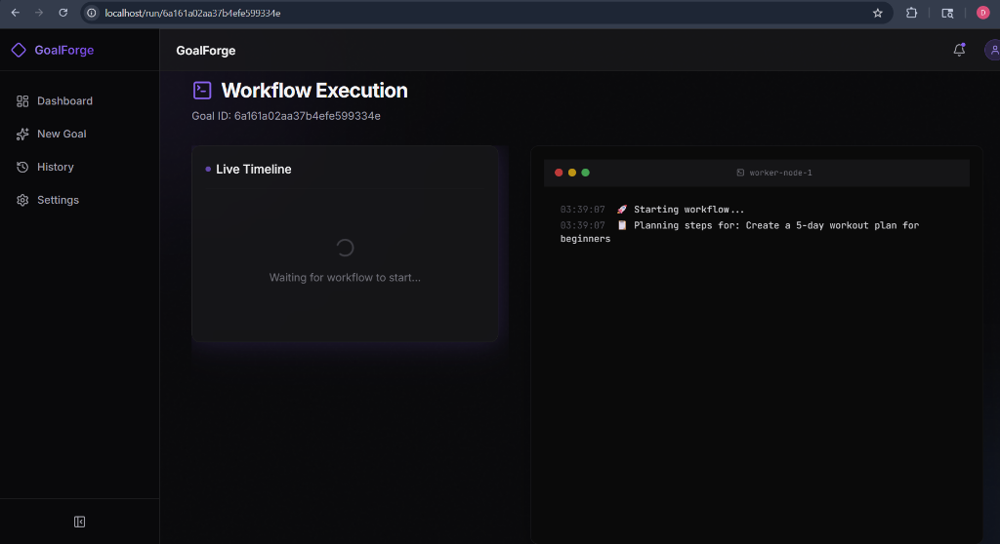
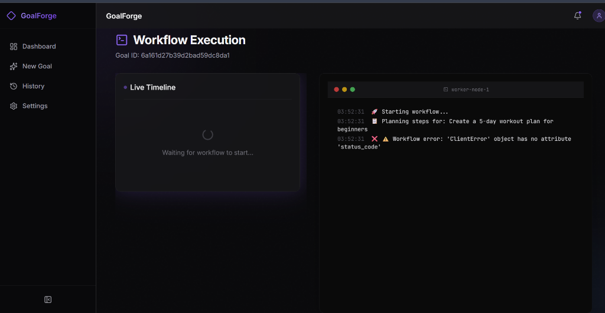
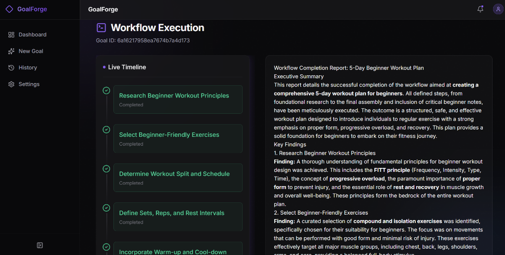

<p align="center">
  
  
  
  
  
</p>

<h1 align="center">⬥ GoalForge AI</h1>

<p align="center">
  <strong>Autonomous Multi-Step AI Workflow Agent</strong><br/>
  <em>Powered by Google Gemini & Google Cloud</em>
</p>

<p align="center">
  Give GoalForge a high-level goal. The Gemini-powered engine autonomously decomposes it into actionable steps, executes them in real-time, and generates a comprehensive AI report — all streamed live to a premium dark-mode dashboard.
</p>

---

## 📷 Screenshots & Visual Walkthrough

Here is a visual walk-through of the GoalForge AI experience, featuring a Vercel-style glassmorphic design system and high-fidelity real-time telemetry.

### 1. Premium Dark-First Dashboard
The central command hub displaying active/completed workflows, live activity charts, and intelligent presets.
<p align="center">
  
</p>

### 2. Autonomous Workflow Planner
Decompose high-level plans with customizable priorities, tags, and intelligent presets.
<p align="center">
  
</p>

### 3. Real-Time Telemetry & Report Synthesis
Live event stream showing step execution alongside macOS-style fake tool terminal logs.
<p align="center">
  
</p>

---

## 🎯 What is GoalForge AI?

GoalForge AI is an **autonomous agentic workflow platform** that transforms any natural language goal into a structured, multi-step execution pipeline. It demonstrates the power of Google's Gemini AI for:

1. **Intelligent Planning** — Gemini analyzes your goal and generates a structured JSON plan with ordered steps
2. **Autonomous Execution** — Each step is executed through the workflow engine with real-time progress streaming
3. **AI Report Generation** — Gemini synthesizes all results into a polished, exportable markdown report

**Built for the [Google Cloud Rapid Agent Hackathon](https://googlecloudrapidhackathon.devpost.com/).**

---

## ✨ Key Features

### 🧠 AI-Powered Workflow Engine
- **Gemini 2.5 Flash** for structured planning via JSON schema enforcement
- **Gemini 2.5 Flash** for professional report generation with markdown formatting
- Automatic fallback plans when API is rate-limited
- Exponential backoff retry logic for 429/rate-limit errors

### 🖥️ Premium Dashboard UI
- **Glassmorphic dark theme** inspired by Vercel, Linear, and OpenAI
- **Animated splash screen** with glow effects on first load
- **Live activity chart** (Recharts) with dynamic data visualization
- **Real-time stat cards** — Total Goals, Active Workflows, Completed, Avg Execution
- **Empty states** with beautiful CTAs throughout

### ⚡ Real-Time Execution Visualization
- **Server-Sent Events (SSE)** stream execution progress to the browser
- **Split-view layout** — Timeline panel + Terminal panel side-by-side
- **macOS-style terminal** with timestamped logs and blinking cursor
- **Progress bar** with percentage tracking across steps
- **Step-by-step status** — Pending → Running → Completed with animated transitions

### 📄 AI Report System
- **Gemini-generated markdown reports** with executive summaries and recommendations
- **Copy to clipboard** — One-click report copying
- **Export as .md** — Download the report as a markdown file
- **Re-run workflow** — Retry any goal with one click

### 🎨 Polish & UX
- **Framer Motion** animations — page transitions, staggered lists, spring physics
- **Keyboard shortcut** — `Ctrl+K` / `Cmd+K` to create a new goal from anywhere
- **Toast notifications** — Success/error feedback on goal creation
- **404 page** — Animated catch-all for unknown routes
- **Mobile responsive** — Collapsible sidebar + mobile bottom navigation
- **Custom favicon** — Brand purple diamond icon

---

## 🏗️ Architecture

```
┌─────────────────────────────────────────────────────────────────────┐
│                         GoalForge AI                                │
├─────────────────────────────┬───────────────────────────────────────┤
│     Frontend (React 19)     │        Backend (FastAPI)              │
│                             │                                       │
│  ┌───────────────────────┐  │  ┌─────────────────────────────────┐  │
│  │   Dashboard Page      │  │  │   API Layer (/api/v1)           │  │
│  │   New Goal Page       │◄─┼──┤   ├── /goals (CRUD)            │  │
│  │   Workflow Run Page   │  │  │   └── /workflows (SSE stream)  │  │
│  │   History Page        │  │  └─────────────┬───────────────────┘  │
│  │   Settings Page       │  │                │                      │
│  └───────────────────────┘  │  ┌─────────────▼───────────────────┐  │
│                             │  │   Workflow Engine                │  │
│  SSE EventSource ◄─────────┼──┤   ├── WorkflowPlanner           │  │
│  (real-time streaming)      │  │   ├── ExecutionContext          │  │
│                             │  │   └── WorkflowService           │  │
│                             │  └─────────────┬───────────────────┘  │
│                             │                │                      │
│                             │  ┌─────────────▼───────────────────┐  │
│                             │  │   Gemini Integration            │  │
│                             │  │   ├── Structured Planning (1x)  │  │
│                             │  │   ├── Report Generation (1x)    │  │
│                             │  │   └── Retry + Rate Limiting     │  │
│                             │  └─────────────┬───────────────────┘  │
│                             │                │                      │
│                             │  ┌─────────────▼───────────────────┐  │
│                             │  │   MongoDB (Atlas)               │  │
│                             │  │   ├── goals collection          │  │
│                             │  │   ├── workflow_runs collection  │  │
│                             │  │   └── steps collection          │  │
│                             │  └─────────────────────────────────┘  │
└─────────────────────────────┴───────────────────────────────────────┘
```

### Workflow Execution Flow

```
User Input → Create Goal (MongoDB) → Trigger Workflow
                                          │
                    ┌─────────────────────┘
                    ▼
          ┌─────────────────┐
          │  PHASE 1: PLAN  │  ← 1 Gemini API call (structured JSON)
          │  Generate steps │
          └────────┬────────┘
                   ▼
          ┌─────────────────┐
          │ PHASE 2: EXECUTE│  ← 0 Gemini API calls (simulated execution)
          │ Run each step   │     Real-time SSE events streamed to frontend
          │ with live logs  │
          └────────┬────────┘
                   ▼
          ┌─────────────────┐
          │ PHASE 3: REPORT │  ← 1 Gemini API call (markdown generation)
          │ AI-generated    │
          │ summary report  │
          └────────┬────────┘
                   ▼
          Goal status → "completed" in MongoDB
          Report delivered via SSE to frontend
```

**Total: 2 Gemini API calls per workflow** — optimized for free-tier rate limits.

---

## 🛠️ Tech Stack

| Layer | Technology | Purpose |
|-------|-----------|---------|
| **Frontend** | React 19, TypeScript, Vite 8 | SPA with type-safe components |
| **Styling** | Tailwind CSS v4, Framer Motion | Glassmorphic UI with animations |
| **State** | Zustand | Lightweight global state (sidebar, UI) |
| **Charts** | Recharts | Dashboard activity visualization |
| **Markdown** | react-markdown | AI report rendering |
| **Routing** | React Router v7 | SPA navigation with nested layouts |
| **Backend** | Python 3.11+, FastAPI | Async REST API + SSE streaming |
| **Database** | MongoDB Atlas, Motor (async) | Goal/workflow/step persistence |
| **AI** | Google Gemini 2.5 Flash, `google-genai` | Planning + report generation |
| **Streaming** | SSE (sse-starlette) | Real-time execution events |
| **Deployment** | Docker, Cloud Run, Vercel | Containerized full-stack deployment |

---

## 📁 Project Structure

```
goalforge-ai/
├── backend/
│   ├── app/
│   │   ├── api/
│   │   │   ├── v1/
│   │   │   │   ├── goals.py          # CRUD endpoints for goals
│   │   │   │   ├── workflows.py      # Workflow trigger + SSE stream
│   │   │   │   └── router.py         # API router aggregation
│   │   │   └── deps.py               # FastAPI dependency injection
│   │   ├── core/
│   │   │   └── exceptions.py         # Custom exception classes
│   │   ├── db/
│   │   │   ├── mongodb.py            # Motor async client setup
│   │   │   ├── collections.py        # Collection name constants
│   │   │   └── repositories/
│   │   │       ├── goal_repo.py      # Goal CRUD operations
│   │   │       └── workflow_repo.py  # Workflow + step operations
│   │   ├── engine/
│   │   │   ├── planner.py            # Gemini-powered workflow planner
│   │   │   └── context.py            # Execution context (history)
│   │   ├── integrations/
│   │   │   └── gemini/
│   │   │       ├── client.py         # GeminiClient with retry logic
│   │   │       ├── prompts.py        # System prompts for planning/execution
│   │   │       └── schemas.py        # JSON schemas for structured output
│   │   ├── models/
│   │   │   ├── goal.py               # Pydantic models for goals
│   │   │   └── workflow.py           # Pydantic models for workflows/steps
│   │   ├── services/
│   │   │   ├── goal_service.py       # Goal business logic
│   │   │   └── workflow_service.py   # Workflow orchestration + SSE
│   │   ├── config.py                 # Pydantic Settings (env vars)
│   │   └── main.py                   # FastAPI app factory
│   ├── Dockerfile                    # Python 3.11-slim container
│   └── requirements.txt              # Python dependencies
│
├── frontend/
│   ├── public/
│   │   └── favicon.svg               # Brand diamond icon
│   ├── src/
│   │   ├── app/
│   │   │   ├── App.tsx               # Root component (Providers + Splash)
│   │   │   ├── Providers.tsx         # Context providers
│   │   │   └── router.tsx            # React Router configuration
│   │   ├── components/
│   │   │   ├── layout/
│   │   │   │   ├── PageShell.tsx     # Main layout (sidebar + header + content)
│   │   │   │   ├── Sidebar.tsx       # Collapsible navigation sidebar
│   │   │   │   ├── Header.tsx        # Top header bar
│   │   │   │   └── MobileNav.tsx     # Mobile bottom navigation
│   │   │   └── ui/
│   │   │       ├── Badge.tsx         # Status badges with dot indicators
│   │   │       ├── Button.tsx        # Button variants (primary/ghost/danger)
│   │   │       ├── Card.tsx          # Glass-morphic card components
│   │   │       ├── GlowEffect.tsx    # Purple glow hover effect
│   │   │       ├── Input.tsx         # Styled input with icon support
│   │   │       ├── SplashScreen.tsx  # Animated entry splash
│   │   │       └── Toast.tsx         # Global toast notification system
│   │   ├── pages/
│   │   │   ├── DashboardPage.tsx     # Stats + chart + recent goals
│   │   │   ├── NewGoalPage.tsx       # Goal creation with suggestions
│   │   │   ├── WorkflowRunPage.tsx   # Live execution + report view
│   │   │   ├── HistoryPage.tsx       # Goal list with search + delete
│   │   │   ├── SettingsPage.tsx      # API key display + app info
│   │   │   └── NotFoundPage.tsx      # 404 catch-all page
│   │   ├── lib/
│   │   │   ├── api.ts               # Axios API client
│   │   │   ├── constants.ts         # App config + nav items
│   │   │   ├── cn.ts                # Tailwind class merge utility
│   │   │   └── formatters.ts        # Date/time formatters
│   │   ├── stores/
│   │   │   └── uiStore.ts           # Zustand store (sidebar state)
│   │   └── styles/
│   │       └── index.css            # Global styles + design tokens
│   ├── Dockerfile                    # Multi-stage: Node build → Nginx serve
│   ├── index.html                    # HTML entry with SEO meta tags
│   └── package.json                  # NPM dependencies
│
├── docker-compose.yml                # Full-stack orchestration
├── cloudbuild.yaml                   # Google Cloud Build → Cloud Run
├── .env.example                      # Template environment variables
├── .gitignore                        # Excludes .env, node_modules, venv
└── README.md                         # This file
```

---

## 💻 Getting Started

### Prerequisites

- **Node.js** 18+ (for frontend)
- **Python** 3.11+ (for backend)
- **Docker** (optional, for containerized setup)
- **MongoDB Atlas** account (free tier works) or local MongoDB
- **Google Gemini API Key** from [Google AI Studio](https://aistudio.google.com/)

### Option 1: Docker Compose (Recommended)

The fastest way to boot the entire stack:

```bash
# Clone the repository
git clone https://github.com/digantk31/goalforge-ai.git
cd goalforge-ai

# Create environment file
cp .env.example .env    # Mac/Linux
copy .env.example .env  # Windows

# Edit .env with your actual keys
# GEMINI_API_KEY=your_key_here
# MONGODB_URI=your_mongodb_atlas_uri

# Boot the full stack
docker-compose up --build
```

| Service | URL |
|---------|-----|
| Frontend | http://localhost |
| Backend API | http://localhost:8000 |
| API Docs (Swagger) | http://localhost:8000/docs |

### Option 2: Native Development (Hot Reload)

**Backend:**
```bash
cd backend

# Create virtual environment
python -m venv venv
source venv/bin/activate        # Mac/Linux
.\venv\Scripts\activate         # Windows

# Install dependencies
pip install -r requirements.txt

# Create .env with your keys
echo "GEMINI_API_KEY=your_key_here" > .env
echo "MONGODB_URI=your_mongodb_uri" >> .env

# Start the server
uvicorn app.main:app --reload --port 8000
```

**Frontend:**
```bash
cd frontend

# Install dependencies
npm install

# Start dev server
npm run dev
```

Frontend runs at `http://localhost:5173` with hot reload.

---

## 🔌 API Reference

Base URL: `http://localhost:8000/api/v1`

### Goals

| Method | Endpoint | Description |
|--------|----------|-------------|
| `POST` | `/goals/` | Create a new goal |
| `GET` | `/goals/` | List all goals (newest first) |
| `GET` | `/goals/{id}` | Get a single goal |
| `DELETE` | `/goals/{id}` | Delete a goal |

**Create Goal Request:**
```json
{
  "title": "Launch a new AI product",
  "description": "Create a comprehensive go-to-market strategy for an AI startup",
  "status": "pending"
}
```

### Workflows

| Method | Endpoint | Description |
|--------|----------|-------------|
| `POST` | `/workflows/{goal_id}` | Trigger workflow execution |
| `GET` | `/workflows/{goal_id}/stream` | SSE stream of execution events |

**SSE Event Format:**
```json
{
  "step": "Research & Gather Data",
  "status": "completed",
  "id": "step_abc123",
  "log": "✅ Step completed: Research & Gather Data"
}
```

**Final Report Event:**
```json
{
  "step": "Generate Report",
  "status": "completed",
  "report": "# Workflow Report\n\n## Executive Summary\n..."
}
```

### Manual Testing with cURL

```bash
# 1. Create a goal
curl -X POST "http://localhost:8000/api/v1/goals/" \
     -H "Content-Type: application/json" \
     -d '{"title": "AI Strategy", "description": "Design a go-to-market strategy for an AI startup"}'

# 2. Trigger the workflow (use the returned goal ID)
curl -X POST "http://localhost:8000/api/v1/workflows/<GOAL_ID>"

# 3. Stream execution events
curl -N -H "Accept: text/event-stream" \
     "http://localhost:8000/api/v1/workflows/<GOAL_ID>/stream"
```

---

## ☁️ Deployment

### Frontend → Vercel

1. Connect your GitHub repository to [Vercel](https://vercel.com)
2. Set framework preset to **Vite**
3. Add environment variable:
   - `VITE_API_URL` = your Cloud Run backend URL (e.g., `https://goalforge-backend-xxxxx.run.app`)
4. Deploy — Vercel auto-detects the SPA routing

### Backend → Google Cloud Run

```bash
# Authenticate
gcloud auth login

# Deploy with Cloud Build
gcloud builds submit --config cloudbuild.yaml \
  --substitutions=_GEMINI_API_KEY="your_key",_MONGODB_URI="your_uri" .
```

Or set secrets in Cloud Run console:
- `GEMINI_API_KEY` → your Gemini API key
- `MONGODB_URI` → your MongoDB Atlas connection string

---

## ⌨️ Keyboard Shortcuts

| Shortcut | Action |
|----------|--------|
| `Ctrl+K` / `Cmd+K` | Quick-create a new goal |

---

## 🔒 Security

- All API keys and credentials are stored in `.env` files (gitignored)
- `.env` files are **never committed** to version control
- MongoDB Atlas uses TLS encryption for connections
- CORS is configured for development (restrict in production)

---

## 🤝 Contributing

1. Fork the repository
2. Create a feature branch: `git checkout -b feature/amazing-feature`
3. Commit your changes: `git commit -m 'Add amazing feature'`
4. Push to the branch: `git push origin feature/amazing-feature`
5. Open a Pull Request

---

## 📜 License

This project is licensed under the MIT License — see the [LICENSE](LICENSE) file for details.

---

<p align="center">
  Built with 💜 by <a href="https://github.com/digantk31">Digant</a> for the <strong>Google Cloud Rapid Agent Hackathon</strong>
</p>